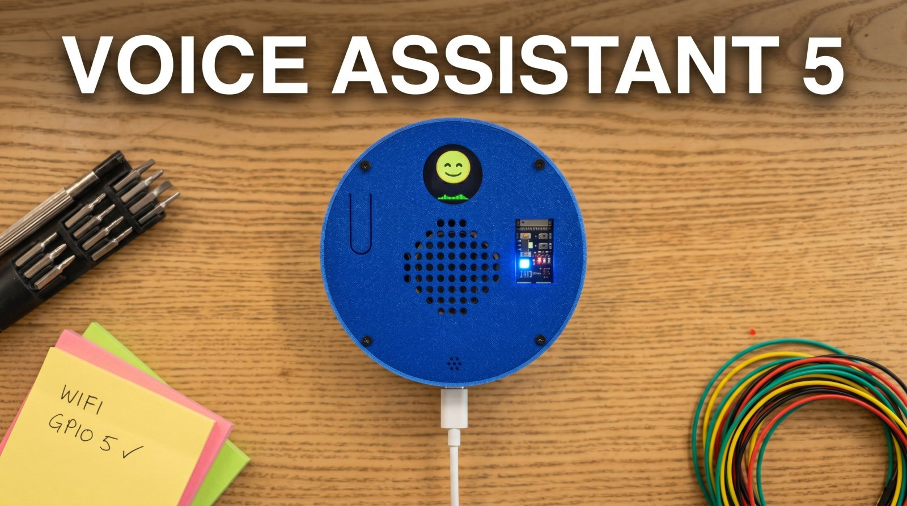

# Voice Assistant 5 -- ESP32-S3 Voice Assistant

Meet your new desk companion: press the button, ask it anything, and get an instant spoken reply -- with an animated emoji face that grins, frowns, or laughs along with the conversation. It's small, expressive, and entirely yours -- a real voice assistant you built yourself, in a case you 3D-printed, powered by your own OpenAI account.



## Features

- **Press to talk, get an instant reply** -- hold the button to speak, release and it answers right back (no wake word, no waiting)
- **Animated emoji face shows you how the assistant feels** -- the assistant itself picks the mood and the display reacts in real time
- **Control the assistant personality** -- write who it is and how it behaves, right from your phone, no code needed
- **Glance to know what it's doing** -- a colored light tells you when it's listening, thinking, or speaking
- **The assistant adjusts its own volume** -- say "speak up" or "quieter please" and it adjusts in real time; the new level persists across reboots
- **Plug in your own OpenAI key** -- you control the account and the cost, no subscription in the middle
- **Make the face your own** -- drop in a GIF, PNG, or JPG from the web portal and the assistant uses it as the on-device emoji; reset back to the defaults any time
- **It remembers the conversation** -- pick up where you left off instead of starting from scratch
- **Set up WiFi once** -- connect from your phone the first time, it remembers your network forever
- **Build it yourself for ~$20** -- 3D-printed case included, full source open and hackable, parts links provided

## Initial Setup

1. **Connect to the device's WiFi.** On first boot the assistant creates an open WiFi network named `VOICE-AGENT-XXYY` (the `XXYY` is the last 2 bytes of its MAC address). No password.
2. **Set your home WiFi.** Your phone should pop the captive portal automatically -- if not, open a browser and go to `http://192.168.4.1`. Enter your WiFi name and password and hit **Save & Restart**. The device remembers it from then on.
3. **Open the settings page.** Once it's on your network, browse to `http://voice-agent-XXYY.local` (same `XXYY` as the AP name). If `.local` doesn't resolve on your network, use the IP address printed to the Serial Monitor.
4. **Make it your own.** By default the assistant is obsessed with Pokémon and will work them into every reply -- charming for about ten minutes. Edit the **System Prompt** field on the settings page to give it any persona you like.

## Under the Hood

A push-to-talk voice assistant built on the ESP32-S3, using the OpenAI Realtime API for speech-to-speech conversation over secure WebSockets. Features dual-core FreeRTOS architecture, animated emoji display with audio waveform visualization, a web configuration portal, and RGB LED status indicators.

Core 0 handles all network and protocol tasks (WiFi, WebSocket, Base64 encode/decode). Core 1 handles all hardware I/O (I2S microphone/speaker, button, display). The two cores communicate through PSRAM ring buffers and volatile flags.

The assistant can also call **OpenAI function tools** during a response — currently `set_display_emotion` (drives the emoji display), `set_volume` (adjusts speaker volume, persists across reboots), and `show_network_info` (shows the device IP and token count on screen).

## Hardware Components

| Component | Description | Comments | Link |
|-----------|-------------|----------|------|
| ESP32-S3 N16R8 | Dev board with 16 MB flash and 8 MB OPI PSRAM |buy the N16R8 varient | [Ali](https://s.click.aliexpress.com/e/_c3gDaUQx), [Amazon](https://amzn.to/4epGav2) |
| INMP441 | I2S MEMS microphone | - | [Ali](https://s.click.aliexpress.com/e/_c4aRLzSX), [Amazon](https://amzn.to/4tT7aI8) |
| MAX98357A | I2S audio amplifier breakout | Better to buy soldered| [Ali](https://s.click.aliexpress.com/e/_c3a1cRKJ), [Amazon](https://amzn.to/4w4aq4O) |
| PCM5102A (optional) | I2S DAC breakout (GY-PCM5102A) with 3.5 mm stereo jack | Skip if you only want the onboard speaker. Drives headphones or any powered speaker (e.g. JBL Go/Clip/Flip) via a 3.5 mm AUX cable. | [Ali](https://s.click.aliexpress.com/e/_c3kweqLP), [Amazon](https://amzn.to/4dvBhQi) |
| Speaker | 1-3W 4/8-ohm or similar small speaker | Up to 57mm, use foam for pressure if the speaker is too thin | [Ali](https://s.click.aliexpress.com/e/_c4tSecWd), [Amazon](https://amzn.to/49pMOhj) |
| GC9A01 | Round TFT display, 240x240, SPI | Get the square one | [Ali](https://s.click.aliexpress.com/e/_c3MHXSVp), [Amazon](https://amzn.to/3RhVD6A) |
| WS2812 NeoPixel | RGB LED (built-in on most ESP32-S3 dev boards) | Nothing to buy, it's built in | - |
| Tactile Push Button | 12x12 mm momentary switch (PTT) | - | [Ali](https://s.click.aliexpress.com/e/_c3t0W2xV), [Amazon](https://amzn.to/4unYv0b) |
| Jumper Wires | Male-to-male/female (for the non PCB version) | - | [Ali](https://s.click.aliexpress.com/e/_c32s7dYx), [Amazon](https://amzn.to/48EsDvR) |
| USB-C Cable | Data + power, Type C to Type A | You should have one at home | [Ali](https://s.click.aliexpress.com/e/_c4mijwjN), [Amazon](https://amzn.to/3QNDeyr) |
| Breadboard | 400 Tie Points |You'll only need one power rail | [Ali](https://s.click.aliexpress.com/e/_c3MZmHuT), [Amazon](https://amzn.to/4w8xcZr) |
| Screws | M2 and M3 Self-Tapping Screws | I recommend a full kit | [Ali](https://s.click.aliexpress.com/e/_c3LsKZUF), [Amazon](https://s.click.aliexpress.com/e/_c3LsKZUF) |

## Pin Assignments

### Microphone -- INMP441

| INMP441 Pin | ESP32-S3 Pin | Note |
|-------------|-------------|------|
| SD (data) | GPIO 40 | I2S data in |
| WS | GPIO 41 | Word select / LRCLK |
| SCK | GPIO 42 | Bit clock |
| L/R | GND | Selects left channel |
| VDD | 3.3V | |
| GND | GND | |

### Speaker Amplifier -- MAX98357A

| MAX98357A Pin | ESP32-S3 Pin | Note |
|--------------|-------------|------|
| DIN | GPIO 17 | I2S data out (shared with PCM5102A if both populated) |
| BCLK | GPIO 47 | Bit clock (shared) |
| LRC | GPIO 21 | Word select / LRCLK (shared) |
| SD | 3.3V *or* GPIO 38 | 3.3V keeps the amp always on (legacy wiring). Tie to GPIO 38 instead if you've also populated the PCM5102A and want to switch between them from the portal. |
| VIN | 5V | |
| GAIN | Not connected | Default 9 dB gain |
| GND | GND | |

### Headphone DAC (optional) -- PCM5102A

Populate this only if you want a headphone jack or want to feed a powered speaker (e.g. JBL) via 3.5 mm AUX. With both chips installed, the portal *Audio Output* selector picks which one plays; firmware mutes the other via its enable pin.

| PCM5102A Pin | ESP32-S3 Pin | Note |
|--------------|-------------|------|
| DIN | GPIO 17 | I2S data out (shared with MAX98357A) |
| BCK | GPIO 47 | Bit clock (shared) |
| LCK | GPIO 21 | Word select / LRCLK (shared) |
| SCK | GND | Use internal PLL (no MCLK from ESP32) |
| XSMT | GPIO 39 | Active-low mute; HIGH = play |
| FMT, FLT, DEMP | GND (factory-set on most breakouts) | I2S format, normal filter, no de-emphasis |
| VIN | 3.3V | Most GY breakouts accept 3.3V or 5V; check silkscreen |
| GND | GND | |
| L / R / GND | 3.5 mm stereo jack | Built into the breakout PCB |

The portal *Audio Output* selector (below *Volume*) picks Speaker (MAX98357A) or Headphones (PCM5102A). The choice persists across reboots. Changes are rejected with HTTP 409 during an active conversation -- save while idle (green LED).

### Display -- GC9A01

| GC9A01 Pin | ESP32-S3 Pin | Note |
|------------|-------------|------|
| SCLK | GPIO 6 | SPI clock |
| MOSI (SDA) | GPIO 7 | SPI data |
| CS | GPIO 5 | Chip select |
| DC | GPIO 4 | Data/command |
| RST | GPIO 2 | Hardware reset |
| BLK | 3.3V | Backlight (always on) |
| VCC | 3.3V | |
| GND | GND | |

### Other

| Component | Pin | ESP32-S3 Pin | Note |
|-----------|-----|-------------|------|
| PTT Button | Signal | GPIO 1 | INPUT_PULLUP, active LOW |
| PTT Button | GND | GND | |
| NeoPixel RGB LED | Data | GPIO 48 | Built-in on most S3 boards, no jumper needed. Also brought out on the expansion header (see below) for future repurposing. |
| MAX98357A SD (optional) | Enable | GPIO 38 | Only needed if you populated the PCM5102A and want runtime switching. Otherwise tie SD to 3.3V. |
| PCM5102A XSMT (optional) | Mute | GPIO 39 | Only populated when PCM5102A is installed. HIGH = play, LOW = mute. |

### Power Summary

| Rail | Components |
|------|-----------|
| 3.3V | INMP441, GC9A01, MAX98357A SD pin (legacy wiring only), GC9A01 BLK, PCM5102A VIN (optional) |
| 5V | MAX98357A VIN |
| GND | All components (common ground) |

### Expansion Header (PCB build only)

The PCB build exposes every ESP32-S3 GPIO that isn't already driven by a peripheral, plus power rails, on two parallel rows of 2.54 mm through-hole pads in the lower band of the board. Solder a male or female header strip if you want one — the pads are unpopulated by default so you can pick whichever fits your add-on.

| Row | Pads | Silkscreen labels (left → right) |
|---|---|---|
| Data (17) | GPIO pins | `0* 3* 8 9 10 11 12 13 14 15 16 18 19 20 45* 46* 48` |
| Power (11) | 3.3 V / GND / 5 V | `3V 3V 3V G G G G G 5V 5V 5V` |

Notes on the data row:
- `*` marks ESP32-S3 boot-strapping pins (GPIO 0, 3, 45, 46) — they have constraints at boot. Use with care.
- GPIO 19 / 20 are also the chip's native USB D−/D+. If a future build adds a PCB-mounted USB-C connector, these become unavailable.
- GPIO 48 is the on-module RGB status LED. It's brought out for future repurposing, but anything you wire to it will fight the firmware's status indicator until you disable that path in code.

Silkscreen labels are shortened (`3V` rather than `3V3`, `G` rather than `GND`) so each label fits within the 2.54 mm pad pitch.

## Build Toolchain

Pick **one** of the two toolchains below -- both build the same `.ino` source. Versions are pinned in [toolchain.md](toolchain.md).

### Option A -- Arduino IDE

Set these under the **Tools** menu before uploading:

| Setting | Value |
|---------|-------|
| **Board** | ESP32S3 Dev Module |
| **USB CDC On Boot** | Enabled |
| **CPU Frequency** | 240MHz (WiFi) |
| **Core Debug Level** | None |
| **USB DFU On Boot** | Disabled |
| **Erase All Flash Before Sketch Upload** | Disabled |
| **Events Run On** | Core 1 |
| **Flash Mode** | QIO 80MHz |
| **Flash Size** | 16MB (128Mb) |
| **JTAG Adapter** | Disabled |
| **Arduino Runs On** | Core 1 |
| **USB Firmware MSC On Boot** | Disabled |
| **Partition Scheme** | Custom (uses `partitions.csv` from sketch folder) |
| **PSRAM** | OPI PSRAM |
| **Upload Mode** | UART0 / Hardware CDC |
| **Upload Speed** | 921600 |
| **USB Mode** | Hardware CDC and JTAG |

The custom partition table (`partitions.csv`) provides 3 MB for the app and ~11 MB for LittleFS (emoji frames).

Install libraries via Arduino Library Manager (`Sketch > Include Library > Manage Libraries...`):

| Library | Author | Note |
|---------|--------|------|
| **ArduinoJson** (v6.x+) | Benoit Blanchon | JSON parsing for API messages |
| **Adafruit NeoPixel** | Adafruit | RGB status LED driver |
| **Arduino_GFX_Library** | moononournation | Display driver (required only when `USE_DISPLAY 1`) |

QR codes (captive-portal join + network info screen) use the `esp_qrcode` API bundled with the ESP32 board package -- no separate library install.

**ArduinoWebsockets** is **vendored** in the `src/` directory with two critical bug fixes applied. Do **not** install it via Library Manager -- the sketch includes the local patched copy automatically. See [websockets_patches.md](voice_agent_5/docs/websockets_patches.md) for details.

### Option B -- PlatformIO

Everything (board settings, partition scheme, libraries, build flags) is pinned in [platformio.ini](platformio.ini). After cloning and copying `config.h.sample` to `config.h` (see below):

```bash
pio run -t upload          # compile + upload sketch
pio run -t uploadfs        # upload LittleFS data partition (emoji frames)
pio device monitor         # serial monitor at 115200, with esp32 exception decoder
```

Or, in VS Code, install the **PlatformIO IDE** extension and use the toolbar buttons (Build / Upload / Upload Filesystem Image / Serial Monitor).

`platformio.ini` uses the [pioarduino](https://github.com/pioarduino/platform-espressif32) fork of the espressif32 platform -- the default upstream platform is stuck on Arduino-ESP32 core 2.x and is missing a header that `Arduino_GFX_Library` 1.6.5 needs. The pin `55.03.38-1` matches Arduino-ESP32 3.3.8.

The vendored ArduinoWebsockets is found via PlatformIO's `src_dir = voice_agent_5` setting -- do not add `arduinoWebsockets` to `lib_deps`.

## Configuration

### config.h

A `config.h.sample` file is included in the sketch folder. Copy it to `config.h` and fill in your credentials:

```bash
cp voice_agent_5/config.h.sample voice_agent_5/config.h
```

Then edit `config.h` and replace the placeholder values with your OpenAI API key (and optionally WiFi credentials):

```cpp
#define OPENAI_API_KEY "sk-your-openai-api-key"
#define WIFI_SSID "your-network-name"
#define WIFI_PASSWORD "your-network-password"
```

`config.h` is listed in `.gitignore` and will not be committed. WiFi credentials are also configurable at runtime via the captive portal and stored in NVS. The API key can also be set via the web UI (stored in NVS, overrides `config.h`).

### WiFi Setup (Captive Portal)

1. On first boot (or when saved credentials fail), the device creates a WiFi access point named `VOICE-AGENT-XXYY` (last 2 bytes of MAC)
2. The RGB LED flashes yellow to indicate configuration mode
3. The display shows a WiFi QR code and join instructions — scan it with your phone to join the network automatically
4. A captive portal page opens automatically (or navigate to `192.168.4.1`)
5. Enter your WiFi SSID and password, then click **Save & Restart**
6. The device restarts and connects to your WiFi network
7. Once connected, the display shows the IP address and a QR code — scan it or enter the IP in a browser to reach the settings page
8. The RGB LED turns green when ready

### Agent Settings (Web Portal)

Once connected to WiFi, open a browser and navigate to `http://voice-agent-XXYY.local` (or the IP address printed to Serial Monitor).

From the settings page you can configure:

- **System Prompt** -- Control the assistant's persona and response style
- **Voice** -- One of the 10 OpenAI Realtime voices (`marin`, `cedar`, `alloy`, `ash`, `ballad`, `coral`, `echo`, `sage`, `shimmer`, `verse`); selection takes effect on the next session
- **Volume** (0 - 100%) -- Speaker playback volume
- **Audio Output** -- Speaker or Headphones (only if the optional PCM5102A DAC is installed)

Less-common options live behind the **Admin Zone** toggle further down the page: Wi-Fi network, your **API Key** (override the compiled `config.h` key, stored in NVS), conversation behavior (Persist Conversation, Verbose Logging), and token usage.

All settings are saved to NVS and persist across reboots. Use **Restore defaults** (in the Admin Zone) to reset the agent settings.

## Emoji Display Setup

### Prerequisites

- GC9A01 display wired per the pin table above
- `USE_DISPLAY` set to `1` in `voice_agent_5.ino` (default)
- Arduino_GFX_Library available (Library Manager for Arduino IDE; auto-resolved from `lib_deps` for PlatformIO)

### Replacing Emojis from Your Browser

Once the device is on WiFi, browse to `http://voice-agent-XXYY.local/emojis` (or hit **Open editor** on the main settings page). Drop in a GIF, PNG, or JPG for any of the seven moods and the assistant will use it immediately -- no re-flash, no Python, no SD card. The shipped defaults are stored separately and are never overwritten, so there is no way to brick the device through customization; reset any mood (or all of them) at any time. See [voice_agent_5/docs/emoji-customization.md](voice_agent_5/docs/emoji-customization.md) for the full walkthrough, supported formats, and how to share an emoji pack.

The customization page needs your browser to have internet access (it loads the GIF decoder and zip libraries from a CDN). The device itself stays local-only.

### Uploading the LittleFS Filesystem

The emoji animations are stored as pre-rendered RGB565 binary frames in a LittleFS partition. They must be flashed separately from the sketch. The sketch and filesystem go to different partitions -- they don't overwrite each other. You only need to re-upload the filesystem when the frame files change.

**With PlatformIO:**

```bash
pio run -t uploadfs
```

`platformio.ini` already points `data_dir` at `voice_agent_5/data/`, so this packages the 56 `.bin` frame files into a LittleFS image and flashes it to the data partition.

**With Arduino IDE** (one-time plugin install):

1. Go to https://github.com/earlephilhower/arduino-littlefs-upload/releases
2. Download the latest `.vsix` file
3. Copy it to `~/.arduinoIDE/plugins/` (create the `plugins` folder if it doesn't exist)
4. Restart Arduino IDE

Then to upload:

1. Close the Serial Monitor (it locks the COM port)
2. Press **Ctrl+Shift+P** to open the Command Palette
3. Type **Upload LittleFS** and select **"Upload LittleFS to Pico/ESP8266/ESP32"**
4. Wait for it to finish

**Verify:** Open Serial Monitor after uploading both sketch and filesystem. You should see:

```
LittleFS mounted.
Display: loaded 8 frames for 'neutral'
Display: GC9A01 initialized
```

### Re-generating Emoji Frames (Optional)

If you want to regenerate the `data/*.bin` files from the source GIFs in `feelings/`:

**Requirements:** Python 3 with Pillow (`pip install Pillow`)

**Run:**

```bash
cd voice_agent_5
python utils/convert_gifs.py
```

This extracts 8 evenly-spaced frames from each GIF, resizes to 150x150, converts to RGB565 little-endian binary, and writes to `data/default/<emotion>_<frame>.bin`. The `default/` subdirectory is the shipped emoji set; runtime overrides written from the captive portal land in `data/custom/` on the device and never touch the defaults.

### Emoji Credits

Emoji animations sourced from [Google Fonts Emoji](https://googlefonts.github.io/), used under the [Creative Commons Attribution 4.0 International License (CC BY 4.0)](https://creativecommons.org/licenses/by/4.0/legalcode).

## Library Patches

ArduinoWebsockets v0.5.3 has two upstream bugs that prevent WSS connections on ESP32: a missing `setInsecure()` method in `SecuredEsp32TcpClient`, and a missing fallback to insecure mode in the ESP32 branch of `upgradeToSecuredConnection()`. Both cause every secure WebSocket connection to fail silently.

The library is vendored in `src/` with fixes already applied -- no manual patching required. For full details, the exact code changes, and instructions for updating to a newer version, see [websockets_patches.md](voice_agent_5/docs/websockets_patches.md).

## Tuning Knobs

### Compile-Time Constants

These are defined in `voice_agent_5.ino` and require recompilation to change:

| Constant | Default | Description |
|----------|---------|-------------|
| `SAMPLE_RATE_IN` | 24000 | Microphone sample rate (Hz). Required by the OpenAI Realtime GA API (`audio/pcm` is fixed at 24 kHz). |
| `SAMPLE_RATE_OUT` | 24000 | Speaker playback rate (Hz). Must match OpenAI Realtime API output format. |
| `JITTER_BUFFER_MS` | 300 | Milliseconds of audio to buffer before starting playback. Higher = smoother but more latency. |
| `LOW_WATER_BYTES` | 3072 | Rebuffer threshold (~64 ms at 24 kHz). When the speaker buffer drops below this during playback, pause and re-accumulate before resuming. |
| `DMA_BLOCK_SIZE` | 1024 | I2S DMA transfer size in bytes per read/write call. |
| `WIFI_CONNECT_TIMEOUT_MS` | 15000 | Time to wait for WiFi before falling back to AP config mode. |
| `EMOJI_FRAME_MS` | 120 | Delay between emoji animation frames (~8 fps). Lower = faster animation. |
| `EMOJI_SIZE_PX` | 150 | Emoji frame dimensions (width and height). Must match `convert_gifs.py` output. |
| `EMOJI_NUM_FRAMES` | 8 | Number of animation frames per emotion. Must match `convert_gifs.py` output. |
| `USE_DISPLAY` | 1 | Set to `0` to disable display entirely (serial-only mode, no GC9A01 or Arduino_GFX needed). |

### Runtime Settings (Web UI / NVS)

These are configurable at runtime via the web portal and persist across reboots:

| Setting | Default | Range | Description |
|---------|---------|-------|-------------|
| System Prompt | "You are a helpful voice assistant..." | up to 12 KB (12288 chars) | Controls assistant persona |
| Voice | `marin` | `alloy`, `ash`, `ballad`, `coral`, `echo`, `sage`, `shimmer`, `verse`, `marin`, `cedar` | OpenAI Realtime voice; applies on next session |
| Persist Conversation | true | boolean | Chain responses via `previous_response_id` |
| Verbose Logging | true | boolean | Detailed serial debug output |
| Volume | 50 | 0 - 100 | Speaker volume (PCM sample scaling) |

## 3D Printed Enclosure

The `box/` directory contains files for a circular 145 mm enclosure designed to hold all components:

- **`box/box3.scad`** -- Parametric OpenSCAD source. Customizable dimensions, component positions, and clearances.
- **`box/box3.stl`** -- Pre-generated STL for the **breadboard/jumper-wire** build. Tray carries printed bosses for the ESP32, display, amp, mic, and button.
- **`box/box3_pcb.stl`** -- Pre-generated STL for the **PCB** build. Tray is flat (only the speaker bosses remain); the four PCB standoffs hang from the lid so the PCB sits at the same height above the tray as in the breadboard build. Ring includes a 3.5 mm jack passthrough aligned with the optional PCM5102A DAC.

Pick whichever STL matches the build you're doing -- you don't need to render anything yourself. If you do want to re-render: open `box3.scad` in OpenSCAD and toggle the two top-level selectors `BUILD_TYPE` (`HOUSING`, `PCB_EDGE_CUTS`, `PCB_MARKING`) and `TRAY_TYPE` (`3DPRINT`, `PCB`). The `RING`, `TRAY`, `LID`, and `ACCESORIES` flags at the top of the file control which parts render in a `HOUSING` build.

The two `box/*.dxf` files (PCB outline and silkscreen reference) are likewise generated from `box3.scad`. They're tracked in git so a PCB designer doesn't need OpenSCAD installed, but the `.scad` is the source of truth — hand-edits to the DXFs are destroyed on the next export. Re-export all four artefacts with `box/housing_export.bat`.

The design uses a tray/ring/lid construction: the tray holds all components (ESP32, display, speaker, mic, amplifier, button) facing down, the ring forms the enclosure wall with USB cutout, and the lid closes the back. Parts are secured with M3 screws into printed bosses.

## State Machine / LED Colors

| State | LED Color | Meaning |
|-------|-----------|---------|
| `STATE_WIFI_WAIT` | Yellow (solid) | Connecting to WiFi |
| `STATE_WIFI_CONFIG` | Yellow (flashing) | AP mode, awaiting WiFi credentials |
| `STATE_READY_FOR_INPUT` | Green | Idle, ready for push-to-talk |
| `STATE_RECORDING` | Pink | Mic active, streaming audio to OpenAI |
| `STATE_THINKING` | Blue | Waiting for API response |
| `STATE_SPEAKING` | Cyan | Playing response audio |

## Adding a Tool

Tools are OpenAI function calls the model makes autonomously during a response. All tool registration lives in `voice_agent_5/tools.ino` — adding a tool is two steps and touches only that one file.

**Step 1 — Write the handler:**

```cpp
static void handleMyToolCall(const String& payload) {
    DynamicJsonDocument doc(256);
    if (deserializeJson(doc, payload) != DeserializationError::Ok) return;

    beginToolCall(doc["call_id"] | "");   // sets up g_pending_call_id and flags

    // parse arguments, do your work, optionally set g_tool_result_output
    g_tool_result_output = "done";
}
```

> **Important:** handlers run inside the WebSocket `onMessage` callback and cannot call `wsClient.send()` directly. Use the flag mechanism (`beginToolCall` + `g_tool_result_output`) — the protocol loop sends the result after `response.done` arrives. For cross-core side effects (display, NVS writes), set a `volatile bool` flag and handle it on Core 1 in `loop()`.

**Step 2 — Register the tool:**

Add an entry to the `TOOLS[]` array in `tools.ino`:

```cpp
{
    "my_tool_name",
    "Plain-text description the model reads to decide when to call this.",
    "{\"type\":\"object\",\"properties\":{"
    "\"param1\":{\"type\":\"string\",\"description\":\"What param1 does\"}"
    "},\"required\":[\"param1\"]}",
    handleMyToolCall
}
```

`buildToolsJson()` will include the new schema in the next `session.update`, and `dispatchToolCall()` will route calls to your handler. No changes to `protocol.ino` needed.

For the full async tool call flow diagram, see [voice_agent_5/docs/architecture.md](voice_agent_5/docs/architecture.md#how-to-add-a-new-tool).

## Architecture Documentation

For detailed technical documentation covering dual-core architecture, ring buffer internals, audio pipeline, protocol details, emoji display system, and memory layout, see [architecture.md](voice_agent_5/docs/architecture.md).

## Troubleshooting

- **LED stays yellow**: WiFi connection failed. The device will fall back to SoftAP mode after 15 seconds. Check your WiFi credentials.
- **No sound from speaker**: Verify the MAX98357A SD pin is connected to 3.3V (not GND).
- **Microphone not picking up audio**: Check INMP441 wiring (especially L/R to GND for left channel).
- **Can't reach `.local` address**: mDNS may not work on all networks/devices. Use the IP address printed to Serial Monitor instead.
- **Display shows text instead of emoji**: LittleFS filesystem not uploaded, or frame files missing. Re-upload the filesystem using the LittleFS plugin.
- **"Display: gfx->begin() FAILED!"**: Check display SPI wiring (especially DC, CS, RST pins).

## License

This project is licensed under [CC BY-NC 4.0](https://creativecommons.org/licenses/by-nc/4.0/) (Creative Commons Attribution-NonCommercial 4.0 International).

You are free to use, modify, and share this project for **non-commercial purposes**, provided you give appropriate attribution.

**For commercial use**, please contact the creator at hello@oriliventures.com to arrange a license.
