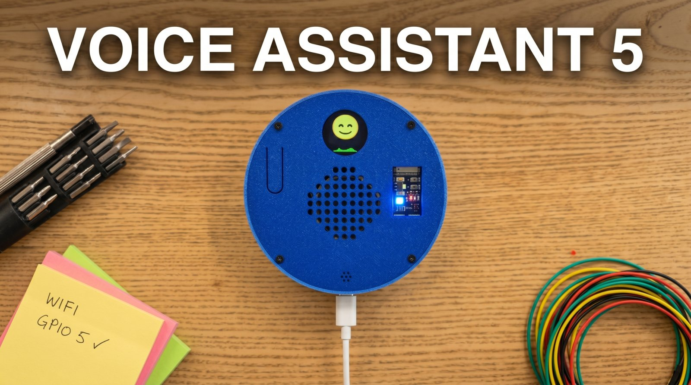

# Voice Assistant 5 — STEM Oriented ESP32 Voice Assistant With No Personality

Press the button, talk, let go — and get an instant spoken reply, with an animated emoji face that grins, frowns and laughs along with the conversation. Less than $20 in parts, a case you print yourself, running on your own OpenAI key.

The part that makes it worth building: **it has no character until you give it one.**



Everything that gives this thing a personality lives behind a web page the device serves. The ~~system~~ persona prompt, one of ten voices, the spoken language, and the face itself:
drop in a GIF, PNG, JPG or MP4 and it adopts immediately. No recompile, no cable, no SD card, no code. Write Nietzsche. Write Churchill. Write Daffy Duck. Hand it to someone else and let them write over it.

That design came out of a classroom. VA5 is used in schools, where students research a figure, write the persona themselves, load it on, and then have to
hold a conversation with what they wrote. A thin characterisation falls apart within a minute or two of being interrogated, so they go back and rewrite it.
Write, test by talking, revise — which is prompt engineering, except nobody has to call it that.

Thirty students cannot each be flashing firmware. That single constraint explains most of the design decisions in this repo: why the whole persona is editable from a phone, and why personas export as a `.zip` so one set of
devices can cycle between classes.


## Features

- **Press to talk, get an instant reply** -- hold the button to speak, release and it answers right back (no wake word, no waiting)
- **Animated emoji face shows you how the assistant feels** -- the assistant itself picks the mood and the display reacts in real time
- **Control the assistant personality** -- write who it is and how it behaves, right from your phone, no code needed
- **Glance to know what it's doing** -- a colored light tells you when it's listening, thinking, or speaking
- **The assistant adjusts its own volume** -- say "speak up" or "quieter please" and it adjusts in real time; the new level persists across reboots
- **Plug in your own OpenAI key** -- you control the account and the cost, no subscription in the middle
- **Make the face your own** -- drop in a GIF, PNG, JPG, or MP4 from the web portal and the assistant uses it as the on-device emoji; reset back to the defaults any time
- **It remembers the conversation** -- pick up where you left off instead of starting from scratch
- **Set up WiFi once, anywhere** -- connect from your phone the first time; it remembers up to 6 networks and picks the right one wherever you take it
- **Build it yourself for ~$20** -- 3D-printed case included, full source open and hackable, parts links provided

## Initial Setup

1. **Connect to the device's WiFi.** On first boot the assistant creates an open WiFi network named `VOICE-AGENT-XXYY` (the `XXYY` is the last 2 bytes of its MAC address). No password.
2. **Set your home WiFi.** Your phone should pop the captive portal automatically -- if not, open a browser and go to `http://192.168.4.1`. Under **Wi-Fi Networks**, enter your network name and password, hit **Add network**, then **Connect & reboot**. The device remembers it from then on -- and up to five more.
3. **Open the settings page.** Once it's on your network, browse to `http://voice-agent-XXYY.local` (same `XXYY` as the AP name). If `.local` doesn't resolve on your network, use the IP address printed to the Serial Monitor.
4. **Make it your own.** By default the assistant is obsessed with Pokémon and will work them into every reply -- charming for about ten minutes. Edit the **System Prompt** field on the settings page to give it any persona you like.

## Under the Hood

A push-to-talk voice assistant built on the ESP32-S3, using the OpenAI Realtime API for speech-to-speech conversation over secure WebSockets. Features dual-core FreeRTOS architecture, animated emoji display with audio waveform visualization, a web configuration portal, and RGB LED status indicators.

Core 0 handles all network and protocol tasks (WiFi, WebSocket, Base64 encode/decode). Core 1 handles all hardware I/O (I2S microphone/speaker, button, display). The two cores communicate through PSRAM ring buffers and volatile flags.

The assistant can also call **OpenAI function tools** during a response — currently `set_display_emotion` (drives the emoji display), `set_volume` (adjusts speaker volume, persists across reboots), and `show_network_info` (shows the device IP and token count on screen).

## Hardware Components

| Component | Description | Comments | Link |
|-----------|-------------|----------|------|
| ESP32-S3 N16R8 | Dev board with 16 MB flash and 8 MB OPI PSRAM |buy the N16R8 varient | [Ali](https://s.click.aliexpress.com/e/_c3gDaUQx), [Amazon](https://amzn.to/4epGav2) |
| INMP441 | I2S MEMS microphone | - | [Ali](https://s.click.aliexpress.com/e/_c4aRLzSX), [Amazon](https://amzn.to/4tT7aI8) |
| MAX98357A | I2S audio amplifier breakout | Better to buy soldered| [Ali](https://s.click.aliexpress.com/e/_c3a1cRKJ), [Amazon](https://amzn.to/4w4aq4O) |
| PCM5102A (optional) | I2S DAC breakout (GY-PCM5102A) with 3.5 mm stereo jack | Skip if you only want the onboard speaker. Drives headphones or any powered speaker (e.g. JBL Go/Clip/Flip) via a 3.5 mm AUX cable. | [Ali](https://s.click.aliexpress.com/e/_c3kweqLP), [Amazon](https://amzn.to/4dvBhQi) |
| Speaker | 1-3W 4/8-ohm or similar small speaker | Up to 57mm, use foam for pressure if the speaker is too thin | [Ali](https://s.click.aliexpress.com/e/_c4tSecWd), [Amazon](https://amzn.to/49pMOhj) |
| GC9A01 | Round TFT display, 240x240, SPI | Get the square one | [Ali](https://s.click.aliexpress.com/e/_c3MHXSVp), [Amazon](https://amzn.to/3RhVD6A) |
| WS2812 NeoPixel | RGB LED (built-in on most ESP32-S3 dev boards) | Nothing to buy, it's built in | - |
| Tactile Push Button | 12x12 mm momentary switch (PTT) | - | [Ali](https://s.click.aliexpress.com/e/_c3t0W2xV), [Amazon](https://amzn.to/4unYv0b) |
| Jumper Wires | Male-to-male/female (for the non PCB version) | - | [Ali](https://s.click.aliexpress.com/e/_c32s7dYx), [Amazon](https://amzn.to/48EsDvR) |
| USB-C Cable | Data + power, Type C to Type A | You should have one at home | [Ali](https://s.click.aliexpress.com/e/_c4mijwjN), [Amazon](https://amzn.to/3QNDeyr) |
| Breadboard | 400 Tie Points |You'll only need one power rail | [Ali](https://s.click.aliexpress.com/e/_c3MZmHuT), [Amazon](https://amzn.to/4w8xcZr) |
| Screws | M2 and M3 Self-Tapping Screws | I recommend a full kit | [Ali](https://s.click.aliexpress.com/e/_c3LsKZUF), [Amazon](https://s.click.aliexpress.com/e/_c3LsKZUF) |


## Personas
A persona is a character the device becomes: a system prompt, a voice, a language and an emoji set, bundled together. The settings page has a **Browse** gallery that pulls ready-made ones straight from this repo, and you can export your own as a `.zip` to back up, share, or hand to a class.

Shipped categories include Science (Ada Lovelace, Marie Curie, Sir Isaac Newton), Historical (Abraham Lincoln, Winston Churchill) and Philosophy (Friedrich Nietzsche, Yoda, Daffy Duck) — alongside Biblical, Theological, and a Functional category holding an ESP32 that explains its own hardware.

Writing your own is the interesting part. Vague personas produce vague conversations — the difference between "you are Winston Churchill" and a paragraph on what he knew, how he spoke, what he refused to discuss and where
he was wrong is immediately audible.

Personas live in [`personas/`](personas). Pull requests welcome.

There is also a persona-creating skill for Google's Antigravity in [`.agents/skills/persona-creator/`](.agents/skills/persona-creator/) — the same workflow the personas above were built with.

## Custom PCB (Optional)

Don't want to breadboard it? [`pcb/`](pcb/) has a custom 2-layer breakout PCB that wires up the same components fixed pin-for-pin (matching the tables below) and adds a solder-in expansion header for spare GPIOs. This is the exact board design that was ordered, assembled, and is running the unit here at VA5 HQ — not an unverified first spin.

What's in `pcb/`:
- **`va5pcb.kicad_pcb` + `va5pcb.kicad_pro`** -- the KiCad board project. Open it in [KiCad](https://www.kicad.org/) (8.0+) to inspect footprint placement, silkscreen, or the routed copper before ordering.
- **`fab/`** -- bare-board gerbers + Excellon drill (`*.gbr`, `*.drl`, `.gbrjob`), already exported and ready to hand to a fab house (JLCPCB, PCBWay, etc.) as-is. Standard 2-layer board, no unusual stackup.

The board was scripted-routed then hand-finished in KiCad (a couple of stragglers a headless autorouter leaves behind); run your own DRC pass in KiCad if you want to double-check before ordering. The parametric generator that produced this board (component placement, net list, silkscreen) isn't part of this release -- `pcb/` ships the finished design, not the pipeline that built it.

Populate it with the same parts as the [Hardware Components](#hardware-components) table above (skip the breadboard and jumper wires -- solder straight onto the board footprints instead). The PCM5102A headphone DAC is optional, same as the breadboard build; if you install it, use the **PCB build** parts (`ring_pcb.stl`, `top_pcb.stl`, `bottom_pcb.stl`) from [3D Printed Enclosure](#3d-printed-enclosure) below, which carry a matching 3.5 mm jack hole in the ring. The board's spare-GPIO header is documented in [Expansion Header (PCB build only)](#expansion-header-pcb-build-only) below.

## Pin Assignments

### Microphone -- INMP441

| INMP441 Pin | ESP32-S3 Pin | Note |
|-------------|-------------|------|
| SD (data) | GPIO 40 | I2S data in |
| WS | GPIO 41 | Word select / LRCLK |
| SCK | GPIO 42 | Bit clock |
| L/R | GND | Selects left channel |
| VDD | 3.3V | |
| GND | GND | |

### Speaker Amplifier -- MAX98357A

| MAX98357A Pin | ESP32-S3 Pin | Note |
|--------------|-------------|------|
| DIN | GPIO 17 | I2S data out (shared with PCM5102A if both populated) |
| BCLK | GPIO 47 | Bit clock (shared) |
| LRC | GPIO 21 | Word select / LRCLK (shared) |
| SD | 3.3V *or* GPIO 38 | 3.3V keeps the amp always on (legacy wiring). Tie to GPIO 38 instead if you've also populated the PCM5102A and want to switch between them from the portal. |
| VIN | 5V | |
| GAIN | 3.3V | 6 dB gain (recommended) -- avoids amp clipping/distortion into an 8 Ω speaker at high volume |
| GND | GND | |

### Headphone DAC (optional) -- PCM5102A

Populate this only if you want a headphone jack or want to feed a powered speaker (e.g. JBL) via 3.5 mm AUX. With both chips installed, the portal *Audio Output* selector picks which one plays; firmware mutes the other via its enable pin.

| PCM5102A Pin | ESP32-S3 Pin | Note |
|--------------|-------------|------|
| DIN | GPIO 17 | I2S data out (shared with MAX98357A) |
| BCK | GPIO 47 | Bit clock (shared) |
| LCK | GPIO 21 | Word select / LRCLK (shared) |
| SCK | GND | Use internal PLL (no MCLK from ESP32) |
| XSMT | GPIO 39 | Active-low mute; HIGH = play |
| FMT, FLT, DEMP | GND (factory-set on most breakouts) | I2S format, normal filter, no de-emphasis |
| VIN | 3.3V | Most GY breakouts accept 3.3V or 5V; check silkscreen |
| GND | GND | |
| L / R / GND | 3.5 mm stereo jack | Built into the breakout PCB |

The portal *Audio Output* selector (below *Volume*) picks Speaker (MAX98357A) or Headphones (PCM5102A). The choice persists across reboots. Changes are rejected with HTTP 409 during an active conversation -- save while idle (green LED).

### Display -- GC9A01

| GC9A01 Pin | ESP32-S3 Pin | Note |
|------------|-------------|------|
| SCLK | GPIO 6 | SPI clock |
| MOSI (SDA) | GPIO 7 | SPI data |
| CS | GPIO 5 | Chip select |
| DC | GPIO 4 | Data/command |
| RST | GPIO 2 | Hardware reset |
| BLK | 3.3V | Backlight (always on) |
| VCC | 3.3V | |
| GND | GND | |

### Other

| Component | Pin | ESP32-S3 Pin | Note |
|-----------|-----|-------------|------|
| PTT Button | Signal | GPIO 1 | INPUT_PULLUP, active LOW |
| PTT Button | GND | GND | |
| NeoPixel RGB LED | Data | GPIO 48 | Built-in on most S3 boards, no jumper needed. Also brought out on the expansion header (see below) for future repurposing. |
| MAX98357A SD (optional) | Enable | GPIO 38 | Only needed if you populated the PCM5102A and want runtime switching. Otherwise tie SD to 3.3V. |
| PCM5102A XSMT (optional) | Mute | GPIO 39 | Only populated when PCM5102A is installed. HIGH = play, LOW = mute. |

### Power Summary

| Rail | Components |
|------|-----------|
| 3.3V | INMP441, GC9A01, MAX98357A SD pin (legacy wiring only), GC9A01 BLK, PCM5102A VIN (optional) |
| 5V | MAX98357A VIN |
| GND | All components (common ground) |

### Expansion Header (PCB build only)

The PCB build exposes every ESP32-S3 GPIO that isn't already driven by a peripheral, plus power rails, on unpopulated 2.54 mm through-hole pads. Solder a male or female header strip if you want one — pick whichever fits your add-on. Most pads sit in the lower band of the board; four GPIOs are on a small **screen-side** header in the gap between the ESP and the display.

| Header | Pads | Silkscreen labels |
|---|---|---|
| Data — bottom (J9) | 8 GPIO | `9 48 10 11 12 13 14 19` |
| Data — screen-side (J13) | 4 GPIO | `15 16 18 8` |
| Power — bottom (J10) | 7 | `3V 3V G G G 5V 5V` (2×3.3 V / 3×GND / 2×5 V) |

Notes on the data row:
- The four ESP32-S3 boot-strapping pins (GPIO 0, 3, 45, 46) are **not** broken out — they have boot-time constraints, so the header exposes only freely-usable GPIO.
- GPIO 19 is also the chip's native USB D−. GPIO 20 (the other native USB line, D+) is **not** broken out on this header. If a future build uses the chip's native USB, GPIO 19 becomes unavailable too.
- GPIO 48 is the on-module RGB status LED. It's brought out for future repurposing, but anything you wire to it will fight the firmware's status indicator until you disable that path in code.

Silkscreen labels are shortened (`3V` rather than `3V3`, `G` rather than `GND`) so each label fits within the 2.54 mm pad pitch.

## Build Toolchain

Pick **one** of the two toolchains below -- both build the same `.ino` source. Versions are pinned in [toolchain.md](toolchain.md).

### Option A -- Arduino IDE

Set these under the **Tools** menu before uploading:

| Setting | Value |
|---------|-------|
| **Board** | ESP32S3 Dev Module |
| **USB CDC On Boot** | Enabled |
| **CPU Frequency** | 240MHz (WiFi) |
| **Core Debug Level** | None |
| **USB DFU On Boot** | Disabled |
| **Erase All Flash Before Sketch Upload** | Disabled |
| **Events Run On** | Core 1 |
| **Flash Mode** | QIO 80MHz |
| **Flash Size** | 16MB (128Mb) |
| **JTAG Adapter** | Disabled |
| **Arduino Runs On** | Core 1 |
| **USB Firmware MSC On Boot** | Disabled |
| **Partition Scheme** | Custom (uses `partitions.csv` from sketch folder) |
| **PSRAM** | OPI PSRAM |
| **Upload Mode** | UART0 / Hardware CDC |
| **Upload Speed** | 921600 |
| **USB Mode** | Hardware CDC and JTAG |

The custom partition table (`partitions.csv`) provides 3 MB for the app and ~11 MB for LittleFS (emoji frames).

Install libraries via Arduino Library Manager (`Sketch > Include Library > Manage Libraries...`):

| Library | Author | Note |
|---------|--------|------|
| **ArduinoJson** (v6.x+) | Benoit Blanchon | JSON parsing for API messages |
| **Adafruit NeoPixel** | Adafruit | RGB status LED driver |
| **Arduino_GFX_Library** | moononournation | Display driver (required only when `USE_DISPLAY 1`) |

QR codes (captive-portal join + network info screen) use the `esp_qrcode` API bundled with the ESP32 board package -- no separate library install.

**ArduinoWebsockets** is **vendored** in the `src/` directory with two critical bug fixes applied. Do **not** install it via Library Manager -- the sketch includes the local patched copy automatically. See [websockets_patches.md](voice_agent_5/docs/websockets_patches.md) for details.

### Option B -- PlatformIO

Everything (board settings, partition scheme, libraries, build flags) is pinned in [platformio.ini](platformio.ini). After cloning and copying `config.h.sample` to `config.h` (see below):

```bash
pio run -t upload          # compile + upload sketch
pio run -t uploadfs        # upload LittleFS data partition (emoji frames)
pio device monitor         # serial monitor at 115200, with esp32 exception decoder
```

Or, in VS Code, install the **PlatformIO IDE** extension and use the toolbar buttons (Build / Upload / Upload Filesystem Image / Serial Monitor).

`platformio.ini` uses the [pioarduino](https://github.com/pioarduino/platform-espressif32) fork of the espressif32 platform -- the default upstream platform is stuck on Arduino-ESP32 core 2.x and is missing a header that `Arduino_GFX_Library` 1.6.5 needs. The pin `55.03.38-1` matches Arduino-ESP32 3.3.8.

The vendored ArduinoWebsockets is found via PlatformIO's `src_dir = voice_agent_5` setting -- do not add `arduinoWebsockets` to `lib_deps`.

## Configuration

### config.h

A `config.h.sample` file is included in the sketch folder. Copy it to `config.h` and fill in your credentials:

```bash
cp voice_agent_5/config.h.sample voice_agent_5/config.h
```

Then edit `config.h` and replace the placeholder values with your OpenAI API key (and optionally WiFi credentials):

```cpp
#define OPENAI_API_KEY "sk-your-openai-api-key"
#define WIFI_SSID "your-network-name"
#define WIFI_PASSWORD "your-network-password"
```

`config.h` is listed in `.gitignore` and will not be committed. WiFi credentials are also configurable at runtime via the captive portal and stored in NVS. The API key can also be set via the web UI (stored in NVS, overrides `config.h`).

### WiFi Setup (Captive Portal)

1. On first boot (or when none of the saved networks can be reached), the device creates a WiFi access point named `VOICE-AGENT-XXYY` (last 2 bytes of MAC)
2. The RGB LED flashes yellow to indicate configuration mode
3. The display shows a WiFi QR code and join instructions — scan it with your phone to join the network automatically
4. A captive portal page opens automatically (or navigate to `192.168.4.1`)
5. Under **Wi-Fi Networks**, enter your network name and password and click **Add network** (or press **Scan** and pick it from the list), then **Connect & reboot**
6. The device restarts and connects to your WiFi network
7. Once connected, the display shows the IP address and a QR code — scan it or enter the IP in a browser to reach the settings page
8. The RGB LED turns green when ready

**Shortcut:** hold the push-to-talk button while powering the device on to go straight to the config portal, without waiting for it to try the saved networks first.

### Multiple WiFi Networks

The device remembers up to **6 networks**, so it can move between home, the office and a phone hotspot without being set up again.

- **At power-on** it scans, then joins the most recently used saved network that is in range. If that one fails it tries the next, and so on; only when they have all failed does it open the config portal. The display names each network as it tries it.
- **A failed connection never erases the network.** An AP that was simply switched off stays in the list.
- **Add networks ahead of time.** You can save a network you are nowhere near — type its name and password, and it will be used the next time it is in range. Adding a network does not reboot the device or disturb the current connection.
- **Full list?** Saving a seventh network drops the least recently used one to make room, and the page tells you which one went. Networks you have saved but never actually connected to are dropped first.
- **Switching now.** Press **Connect** on any saved network to reboot into it. The device attempts that exact network first, whether or not it showed up in a scan. If it can't be reached, it falls back to its usual order rather than refusing, and tells you so when you next load the settings page: *"Couldn't reach UdisS24P — still on Tirosh-g."* **Forget** removes one; forgetting the network you are currently using does not cut you off, it just stops the device from choosing it again.

Passwords are stored on the device and are never shown again — not on the settings page and not through its API. They are, however, stored unencrypted in the ESP32's NVS flash, so treat physical access to the board as access to those passwords.

### Agent Settings (Web Portal)

Once connected to WiFi, open a browser and navigate to `http://voice-agent-XXYY.local` (or the IP address printed to Serial Monitor).

From the settings page you can configure:

- **System Prompt** -- Control the assistant's persona and response style
- **Voice** -- One of the 10 OpenAI Realtime voices (`marin`, `cedar`, `alloy`, `ash`, `ballad`, `coral`, `echo`, `sage`, `shimmer`, `verse`); selection takes effect on the next session
- **Language** -- The language the assistant speaks. Default **Automatic** matches whatever language you speak; pick a specific language to force every reply into it. Takes effect on the next session
- **Volume** (0 - 100%) -- Speaker playback volume
- **Audio Output** -- Speaker or Headphones (only if the optional PCM5102A DAC is installed)
- **Import / Export Profile** -- **Browse** a gallery of ready-made personas, or back up / transfer your own persona, voice, volume and emoji as a single `.zip` file. Secrets (Wi-Fi, API key) are never exported. Needs the browser to be online. See [voice_agent_5/docs/profile-import-export.md](voice_agent_5/docs/profile-import-export.md).

Less-common options live behind the **Admin Zone** toggle further down the page: **Wi-Fi Networks** (see [Multiple WiFi Networks](#multiple-wifi-networks) above), your **API Key** (override the compiled `config.h` key, stored in NVS), conversation behavior (Persist Conversation, Verbose Logging), and token usage.

All settings are saved to NVS and persist across reboots. Use **Restore defaults** (in the Admin Zone) to reset the agent settings.

The Admin Zone also has **Provision default persona**, which pulls the published default persona -- prompt, voice and emoji -- from the project repo and writes it into the device. Use it to set up a board that was flashed with firmware but no emoji image (so the display would otherwise be blank), or to load a newly published default. Unlike **Restore defaults** (which reverts to the compiled-in fallback prompt and on-device emoji), this downloads the current default from the web, so your browser needs internet. It writes the device's read-only default emoji set directly and checks free storage before changing anything.

## Emoji Display Setup

### Prerequisites

- GC9A01 display wired per the pin table above
- `USE_DISPLAY` set to `1` in `voice_agent_5.ino` (default)
- Arduino_GFX_Library available (Library Manager for Arduino IDE; auto-resolved from `lib_deps` for PlatformIO)

### Replacing Emojis from Your Browser

Once the device is on WiFi, browse to `http://voice-agent-XXYY.local/emojis` (or hit **Open editor** on the main settings page). Drop in a GIF, PNG, JPG, or H.264 MP4 for any of the seven moods and the assistant will use it immediately -- no re-flash, no Python, no SD card. The shipped defaults are stored separately and are never overwritten, so there is no way to brick the device through customization; reset any mood (or all of them) at any time. See [voice_agent_5/docs/emoji-customization.md](voice_agent_5/docs/emoji-customization.md) for the full walkthrough, supported formats, and how to share an emoji pack.

The customization page needs your browser to have internet access (it loads the GIF decoder and zip libraries from a CDN). The device itself stays local-only.

### Uploading the LittleFS Filesystem

The emoji animations are stored as pre-rendered RGB565 binary frames in a LittleFS partition. They must be flashed separately from the sketch. The sketch and filesystem go to different partitions -- they don't overwrite each other. You only need to re-upload the filesystem when the frame files change.

**With PlatformIO:**

```bash
pio run -t uploadfs
```

`platformio.ini` already points `data_dir` at `voice_agent_5/data/`, so this packages the 56 `.bin` frame files into a LittleFS image and flashes it to the data partition.

**With Arduino IDE** (one-time plugin install):

1. Go to https://github.com/earlephilhower/arduino-littlefs-upload/releases
2. Download the latest `.vsix` file
3. Copy it to `~/.arduinoIDE/plugins/` (create the `plugins` folder if it doesn't exist)
4. Restart Arduino IDE

Then to upload:

1. Close the Serial Monitor (it locks the COM port)
2. Press **Ctrl+Shift+P** to open the Command Palette
3. Type **Upload LittleFS** and select **"Upload LittleFS to Pico/ESP8266/ESP32"**
4. Wait for it to finish

**Verify:** Open Serial Monitor after uploading both sketch and filesystem. You should see:

```
LittleFS mounted.
Display: loaded 8 frames for 'neutral'
Display: GC9A01 initialized
```

### Re-generating Emoji Frames (Optional)

If you want to regenerate the `data/*.bin` files from the source GIFs in `feelings/`:

**Requirements:** Python 3 with Pillow (`pip install Pillow`)

**Run:**

```bash
cd voice_agent_5
python utils/convert_gifs.py
```

This extracts 8 evenly-spaced frames from each GIF, resizes to 150x150, converts to RGB565 little-endian binary, and writes to `data/default/<emotion>_<frame>.bin`. The `default/` subdirectory is the shipped emoji set; runtime overrides written from the captive portal land in `data/custom/` on the device and never touch the defaults.

### Emoji Credits

Emoji animations sourced from [Google Fonts Emoji](https://googlefonts.github.io/), used under the [Creative Commons Attribution 4.0 International License (CC BY 4.0)](https://creativecommons.org/licenses/by/4.0/legalcode).

## Library Patches

ArduinoWebsockets v0.5.4 has two upstream bugs that prevent WSS connections on ESP32: a missing `setInsecure()` method in `SecuredEsp32TcpClient`, and a missing fallback to insecure mode in the ESP32 branch of `upgradeToSecuredConnection()`. Both cause every secure WebSocket connection to fail silently. (Both are still present upstream as of v0.5.4.)

The library is vendored in `src/` with fixes already applied -- no manual patching required. For full details, the exact code changes, and instructions for updating to a newer version, see [websockets_patches.md](voice_agent_5/docs/websockets_patches.md). For the licensing side -- upstream version, licence, and the full list of what was modified -- see [VENDORED.md](voice_agent_5/src/VENDORED.md).

## Tuning Knobs

### Compile-Time Constants

These are defined in `voice_agent_5.ino` and require recompilation to change:

| Constant | Default | Description |
|----------|---------|-------------|
| `SAMPLE_RATE_IN` | 24000 | Microphone sample rate (Hz). Required by the OpenAI Realtime GA API (`audio/pcm` is fixed at 24 kHz). |
| `SAMPLE_RATE_OUT` | 24000 | Speaker playback rate (Hz). Must match OpenAI Realtime API output format. |
| `JITTER_BUFFER_MS` | 300 | Milliseconds of audio to buffer before starting playback. Higher = smoother but more latency. |
| `LOW_WATER_BYTES` | 3072 | Rebuffer threshold (~64 ms at 24 kHz). When the speaker buffer drops below this during playback, pause and re-accumulate before resuming. |
| `DMA_BLOCK_SIZE` | 1024 | I2S DMA transfer size in bytes per read/write call. |
| `WIFI_CONNECT_TIMEOUT_MS` | 8000 | Time to wait for each saved network in range before trying the next one. |
| `WIFI_SOLE_TIMEOUT_MS` | 15000 | Time to wait when exactly one saved network is in range — there is nothing to fall through to but the config portal, so it gets a longer budget. |
| `WIFI_MAX_NETWORKS` | 6 | How many WiFi networks are remembered (in `wifi_store.h`). Saving another drops the least recently used one. |
| `EMOJI_FRAME_MS` | 120 | Delay between emoji animation frames (~8 fps). Lower = faster animation. |
| `EMOJI_SIZE_PX` | 150 | Emoji frame dimensions (width and height). Must match `convert_gifs.py` output. |
| `EMOJI_NUM_FRAMES` | 8 | Number of animation frames per emotion. Must match `convert_gifs.py` output. |
| `USE_DISPLAY` | 1 | Set to `0` to disable display entirely (serial-only mode, no GC9A01 or Arduino_GFX needed). |

### Runtime Settings (Web UI / NVS)

These are configurable at runtime via the web portal and persist across reboots:

| Setting | Default | Range | Description |
|---------|---------|-------|-------------|
| System Prompt | "You are a helpful voice assistant..." | up to 12 KB (12288 chars) | Controls assistant persona |
| Voice | `marin` | `alloy`, `ash`, `ballad`, `coral`, `echo`, `sage`, `shimmer`, `verse`, `marin`, `cedar` | OpenAI Realtime voice; applies on next session |
| Language | Automatic | Automatic or one of 13 languages | Forces every reply into the chosen language; Automatic matches whatever you speak. Applies on next session |
| Persist Conversation | true | boolean | Chain responses via `previous_response_id` |
| Verbose Logging | true | boolean | Detailed serial debug output |
| Volume | 50 | 0 - 100 | Speaker volume (PCM sample scaling) |
| Audio Output | Speaker | Speaker / Headphones | Which output plays (only meaningful with the optional PCM5102A installed) |

## 3D Printed Enclosure

The `box/` directory contains the STL files for a circular 145 mm enclosure designed to hold all components. The geometry is a parametric [build123d](https://github.com/gumyr/build123d) (Python) model; the `.stl` files here are pre-generated from it, so you don't need to render anything yourself.

Each printable part is its own STL. Pick the set that matches your build:

- **Breadboard / jumper-wire build:** `ring_3dprint.stl` (carries the same 3.5 mm jack passthrough as the PCB ring, for the optional PCM5102A), `top_3dprint.stl` (the top plate carries printed bosses for the ESP32, display, amp, mic, and button), `bottom.stl`.
- **PCB build:** `ring_pcb.stl` (includes a 3.5 mm jack passthrough aligned with the optional PCM5102A DAC), `top_pcb.stl` (completely flat — the speaker is glued, so there are no bosses), `bottom_pcb.stl` (carries four standoffs that set the PCB height above the bottom plate).
- **Both builds also use:** `speaker_y_bracket.stl`. The breadboard build additionally uses `cantilever_bracket.stl`, `inline_button_frame.stl`, and `inline_button_bracket.stl`.

The parametric build123d source (where dimensions, component positions, and clearances are defined) is maintained in the project's development repo and isn't bundled with this release — just pick the STL set matching your build above and print.

The design uses a top/ring/bottom construction: the **top** plate holds all components (ESP32, display, speaker, mic, amplifier, button) facing **down** into the body — from outside you see its flat face. It is printed feature-side-up and flipped over at assembly; the model is pre-mirrored so that, once flipped, everything lines up with the PCB below. The ring forms the enclosure wall (USB cutout toward the ESP; orient the headphone hole toward the bottom), and the **bottom** plate closes the base. Parts are secured with M3 screws into printed bosses.

## State Machine / LED Colors

| State | LED Color | Meaning |
|-------|-----------|---------|
| `STATE_WIFI_WAIT` | Yellow (solid) | Connecting to WiFi |
| `STATE_WIFI_CONFIG` | Yellow (flashing) | AP mode, awaiting WiFi credentials |
| `STATE_READY_FOR_INPUT` | Green | Idle, ready for push-to-talk |
| `STATE_RECORDING` | Pink | Mic active, streaming audio to OpenAI |
| `STATE_THINKING` | Blue | Waiting for API response |
| `STATE_SPEAKING` | Cyan | Playing response audio |

## Adding a Tool

Tools are OpenAI function calls the model makes autonomously during a response. All tool registration lives in `voice_agent_5/tools.ino` — adding a tool is two steps and touches only that one file.

**Step 1 — Write the handler:**

```cpp
static void handleMyToolCall(const String& payload) {
    DynamicJsonDocument doc(256);
    if (deserializeJson(doc, payload) != DeserializationError::Ok) return;

    beginToolCall(doc["call_id"] | "");   // sets up g_pending_call_id and flags

    // parse arguments, do your work, optionally set g_tool_result_output
    g_tool_result_output = "done";
}
```

> **Important:** handlers run inside the WebSocket `onMessage` callback and cannot call `wsClient.send()` directly. Use the flag mechanism (`beginToolCall` + `g_tool_result_output`) — the protocol loop sends the result after `response.done` arrives. For cross-core side effects (display, NVS writes), set a `volatile bool` flag and handle it on Core 1 in `loop()`.

**Step 2 — Register the tool:**

Add an entry to the `TOOLS[]` array in `tools.ino`:

```cpp
{
    "my_tool_name",
    "Plain-text description the model reads to decide when to call this.",
    "{\"type\":\"object\",\"properties\":{"
    "\"param1\":{\"type\":\"string\",\"description\":\"What param1 does\"}"
    "},\"required\":[\"param1\"]}",
    handleMyToolCall
}
```

`buildToolsJson()` will include the new schema in the next `session.update`, and `dispatchToolCall()` will route calls to your handler. No changes to `protocol.ino` needed.

For the full async tool call flow diagram, see [voice_agent_5/docs/architecture.md](voice_agent_5/docs/architecture.md#how-to-add-a-new-tool).

## Architecture Documentation

For detailed technical documentation covering dual-core architecture, ring buffer internals, audio pipeline, protocol details, emoji display system, and memory layout, see [architecture.md](voice_agent_5/docs/architecture.md).

## Troubleshooting

- **LED stays yellow**: the device is still working through its saved WiFi networks. It tries each one that is in range for 8 seconds before falling back to SoftAP config mode, so with six saved networks this can take about a minute. Hold the push-to-talk button while powering on to skip straight to the config portal.
- **No sound from speaker**: Verify the MAX98357A SD pin is connected to 3.3V (not GND).
- **Microphone not picking up audio**: Check INMP441 wiring (especially L/R to GND for left channel).
- **Can't reach `.local` address**: mDNS may not work on all networks/devices. Use the IP address printed to Serial Monitor instead.
- **Display shows text instead of emoji**: LittleFS filesystem not uploaded, or frame files missing. Re-upload the filesystem using the LittleFS plugin.
- **"Display: gfx->begin() FAILED!"**: Check display SPI wiring (especially DC, CS, RST pins).

## License

VA5 is licensed under [GPL-3.0](LICENSE) (GNU General Public License, version 3).

You can build these devices, use them, modify them, teach with them, and sell them. None of that needs anyone's permission. If you'd like to talk about a commercial arrangement or a classroom deployment, you're welcome to — hello@oriliventures.com — but it isn't a condition of any of the above.

The obligation that comes with GPL-3.0 is share-alike: if you hand someone the firmware, or a device running it, modified or not, they're entitled to the source under this same licence.

### Third-party components

- **ArduinoWebsockets** — a *modified* copy of [gilmaimon/ArduinoWebsockets](https://github.com/gilmaimon/ArduinoWebsockets) v0.5.4 is vendored in [voice_agent_5/src/](voice_agent_5/src/). It is GPL-3.0, and that is why this project is GPL-3.0. What was changed and why: [VENDORED.md](voice_agent_5/src/VENDORED.md); the exact patches: [websockets_patches.md](voice_agent_5/docs/websockets_patches.md).
- **Emoji animations** — from [Google Fonts Emoji](https://googlefonts.github.io/), under [CC BY 4.0](https://creativecommons.org/licenses/by/4.0/legalcode).
- **base64 encoder** — © 2004-2008 René Nyffenegger, zlib-style licence, notice retained in `voice_agent_5/src/tiny_websockets/internals/wscrypto/base64.hpp`.
- **SHA-1 implementation** — from [983/SHA1](https://github.com/983/SHA1), credit retained in `voice_agent_5/src/tiny_websockets/internals/wscrypto/sha1.hpp`.
